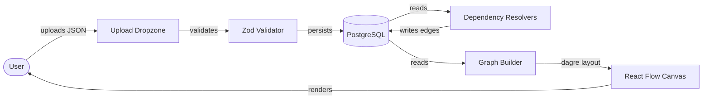
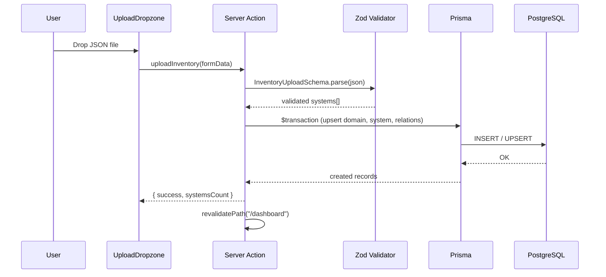
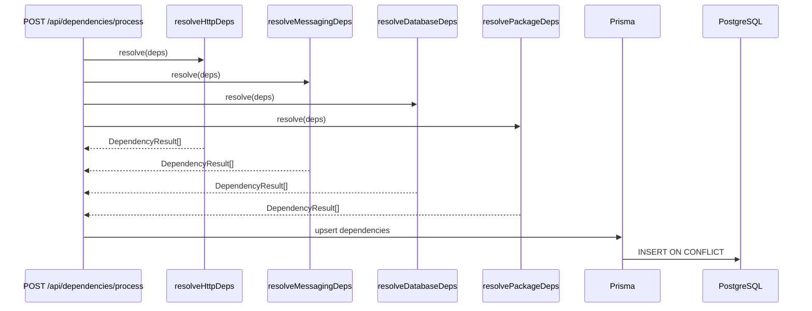
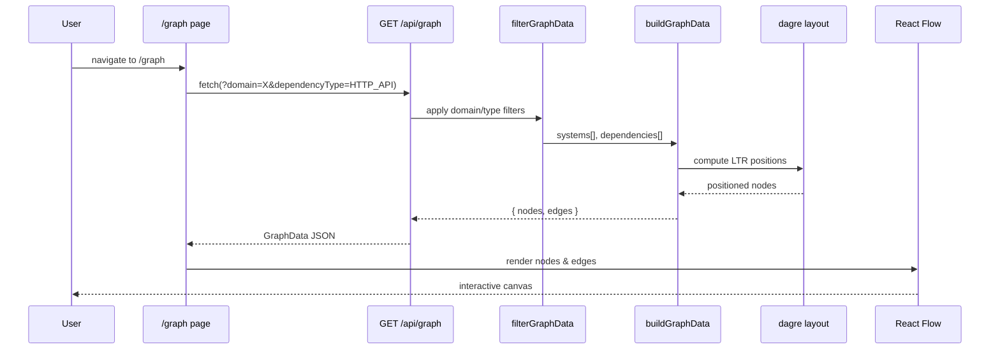
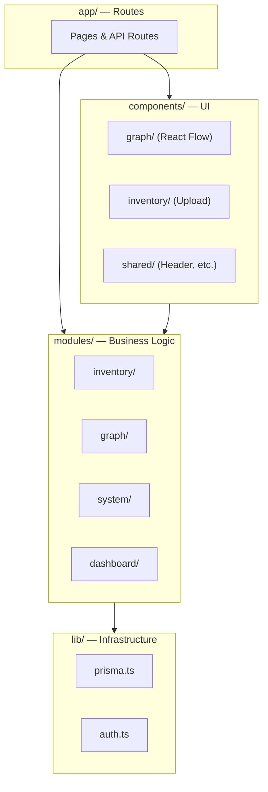
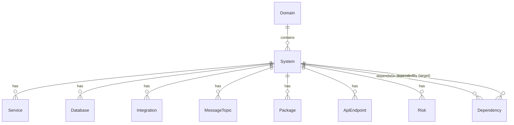
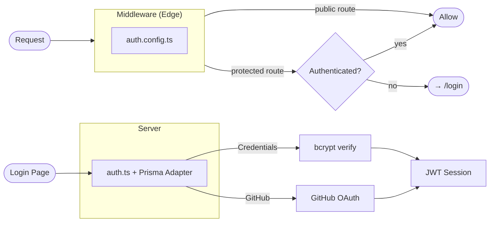

# Architecture

This document describes the high-level architecture of Domain Mapper.

## System Overview

Domain Mapper is a Next.js application that ingests JSON system inventories, automatically resolves inter-system dependencies, and renders an interactive dependency graph.

## Request Flow

### Inventory Upload

### Dependency Resolution

### Graph Rendering

## Module Architecture

## Domain Modules

Each module under `src/modules/` owns its business logic and follows the same structure:

| Module        | Responsibility |
| ------------- | -------------- |
| `inventory`   | Parse and persist JSON system inventories. Validates input via Zod, processes systems in a Prisma transaction. |
| `graph`       | Resolve dependencies across systems (HTTP, messaging, database, package) and build React Flow graph data with dagre layout. |
| `system`      | CRUD operations for systems and domains. |
| `dashboard`   | Aggregate metrics for the dashboard view. |
| `auth`        | Authentication helpers. |

### Dependency Resolvers

The graph module contains four specialized resolvers, each as a pure function with injected dependencies:

| Resolver                    | Detects                                                |
| --------------------------- | ------------------------------------------------------ |
| `resolveHttpDependencies`   | `HTTP_API` edges from integration records              |
| `resolveMessagingDeps`      | `KAFKA_TOPIC`, `RABBITMQ_QUEUE`, `SQS_QUEUE` edges from shared message topics |
| `resolveDatabaseDeps`       | `SHARED_DATABASE` edges from matching database names   |
| `resolvePackageDeps`        | `SHARED_PACKAGE` edges from matching internal packages |

All resolvers receive data-access functions (not Prisma directly), making them unit-testable without a database.

## Data Model (simplified)

See `prisma/schema.prisma` for the full schema definition.

## Authentication

- **Edge middleware** (`middleware.ts`) uses the lightweight `auth.config.ts` to protect routes under `(dashboard)`.
- **Full auth config** (`auth.ts`) includes the Prisma adapter for persisting OAuth accounts and uses JWT sessions.
- Providers: **Credentials** (email + bcrypt password) and **GitHub** OAuth.
